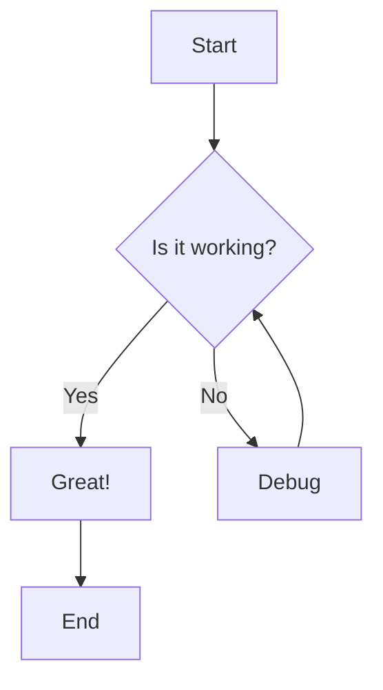
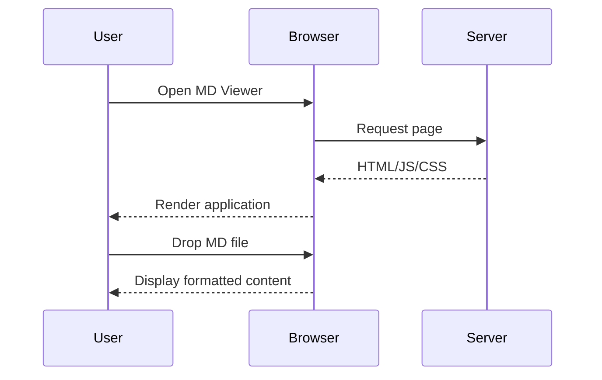
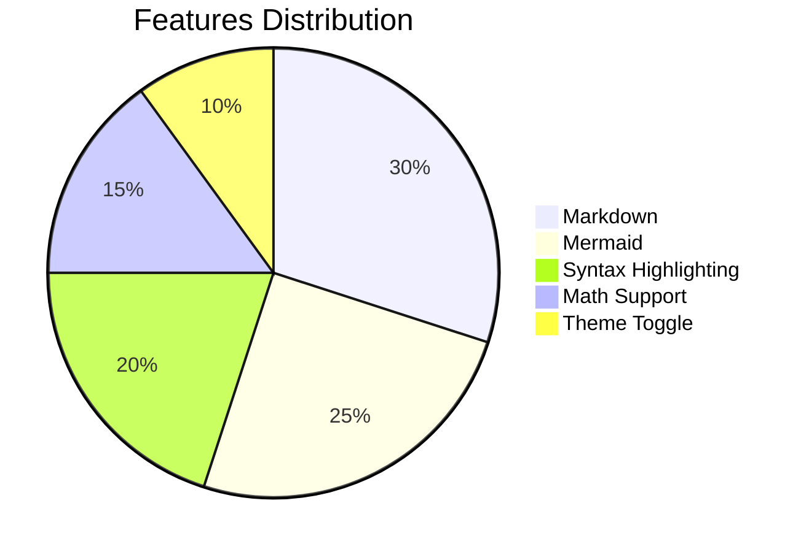

# MD Viewer Demo

Welcome to the MD Viewer demo! This document showcases all the features.

## Table of Contents

This document is automatically parsed to generate a table of contents in the sidebar.

## Text Formatting

This is **bold text** and this is *italic text*. You can also use ~~strikethrough~~ and `inline code`.

Here's a [link to GitHub](https://github.com).

## Lists

### Unordered List
- Item 1
- Item 2
  - Nested item
  - Another nested item
- Item 3

### Ordered List
1. First item
2. Second item
3. Third item

### Task List
- [x] Completed task
- [ ] Incomplete task
- [ ] Another task

## Code Blocks

### JavaScript
```javascript
function greet(name) {
  console.log(`Hello, ${name}!`);
  return {
    message: 'Welcome',
    timestamp: Date.now()
  };
}

greet('World');
```

### Python
```python
def fibonacci(n):
    """Generate Fibonacci sequence up to n terms."""
    a, b = 0, 1
    result = []
    for _ in range(n):
        result.append(a)
        a, b = b, a + b
    return result

print(fibonacci(10))
```

## Mermaid Diagrams

### Flowchart


### Sequence Diagram


### Pie Chart


## Math Equations

### Inline Math
The famous equation $E = mc^2$ shows the relationship between energy and mass.

The quadratic formula is $x = \frac{-b \pm \sqrt{b^2 - 4ac}}{2a}$.

### Block Math
The sum of a geometric series:

$$
\sum_{i=0}^{n} ar^i = a \cdot \frac{1 - r^{n+1}}{1 - r}
$$

Maxwell's equations in differential form:

$$
\nabla \cdot \mathbf{E} = \frac{\rho}{\varepsilon_0}
$$

$$
\nabla \cdot \mathbf{B} = 0
$$

## Tables

| Feature | Status | Priority |
|---------|--------|----------|
| Markdown Rendering | Complete | High |
| Mermaid Diagrams | Complete | High |
| Syntax Highlighting | Complete | Medium |
| Math Support | Complete | Medium |
| Dark/Light Theme | Complete | Low |

## Blockquotes

> "The best way to predict the future is to invent it."
> — Alan Kay

> **Note:** This is a styled blockquote with formatting inside.
>
> It can span multiple paragraphs.

## Images

Images are supported with standard markdown syntax:


## Horizontal Rule

---

## Conclusion

This concludes the demo of MD Viewer. Try toggling the theme with the button in the toolbar, or print this document using the print button!
